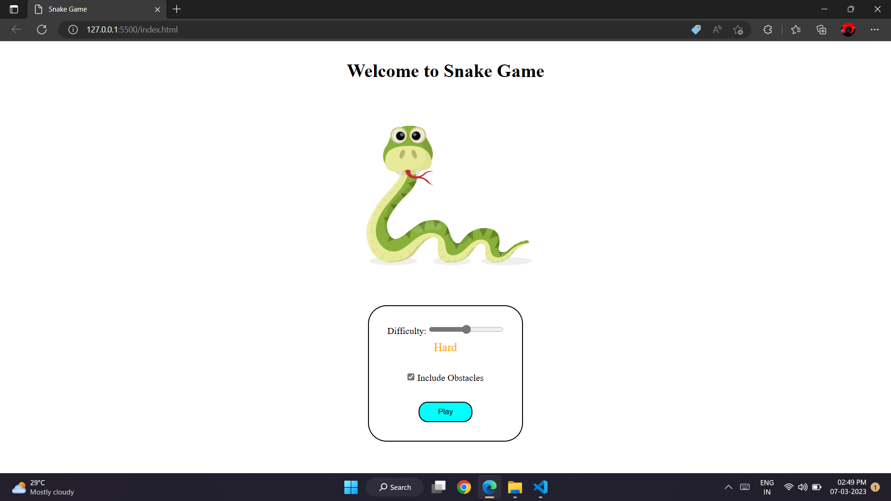
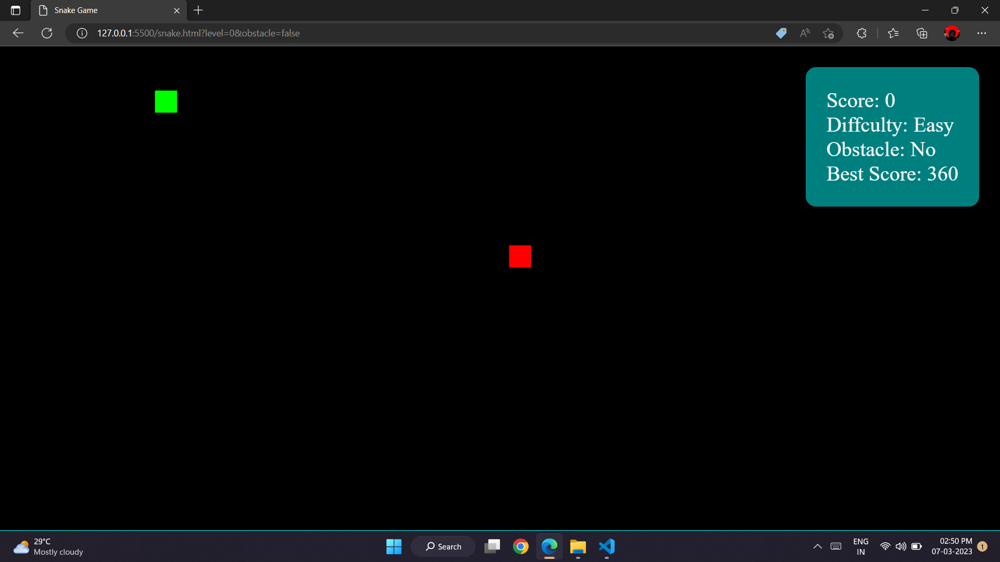
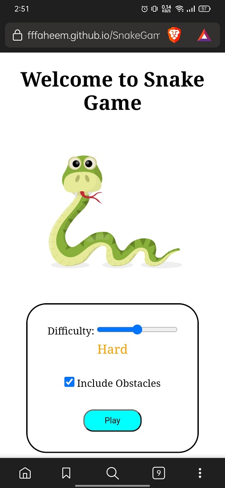
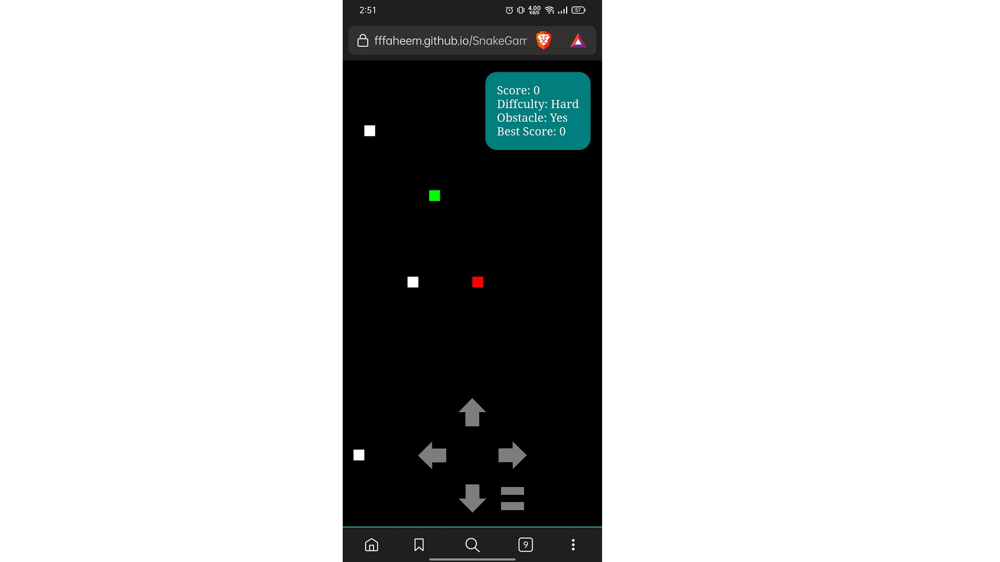

# Snake Game 🐍

This is a simple and fun snake game that you can play on your browser. It is built with HTML, CSS and JavaScript. It has multiple levels and some obstacles based on it. Plus, it is mobile responsive too, so you can enjoy it on your phone or tablet as well.

## How to play

The goal of the game is to control the snake and eat as many apples(red dots) as possible without touching the walls or the snake's body or obstacles. You can use the arrow keys or buttons provided on the screen to move the snake. As the snake eats more apples, it grows longer.
The game gets more challenging based on the difficulty level.

## 🕹️ Gameplay Features

- Multiple levels with increasing difficulty
- Obstacles that the snake must avoid
- Score tracking system
- Mobile responsive design for gaming on the go

## Screenshots

Here are some screenshots of the game running on both PC and mobile.

### PC

*This is how the game looks on a PC browser.

### Mobile

*This is how the game looks on a mobile browser. Control button are provided to play the game.

## How to run

1. Clone this repository to your local machine.
2. Open the `index.html` file in your web browser.
3. Start playing!
Alternatively, you can also visit [here](https://fffaheem.github.io/SnakeGame/).

## Credits

This game is inspired by the classic snake game from the late 70s.
I hope you enjoy playing this game as much as I enjoyed making it. Feel free to fork, clone, or modify this project as you wish. If you have any feedback or suggestions, please let me know. Thank you!